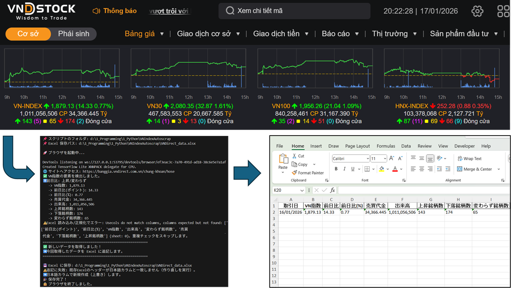

**📈 VNIndex Auto Scraper (VNDirect)**
**概要（Overview）**

本プロジェクトは、VNDirect（ベトナム証券会社） の株式情報サイトから
VNIndex（HOSE）関連データを自動取得し、Excel ファイルへ安全に蓄積する Python スクリプトです。

Selenium を用いた実運用レベルの Web スクレイピングに加え、
重複データ防止・取引日判定・Excel 追記処理など、
業務用途を想定した堅牢な設計を行っています。

**✨ 本コードの特徴・強み** 
1️⃣ スクリプトと同一フォルダへの安全な Excel 保存
BASE_DIR = os.path.dirname(os.path.abspath(__file__))
EXCEL_FILE_PATH = os.path.join(BASE_DIR, "VNDirect_data.xlsx")
実行ディレクトリ（CWD）に依存せず
常に loadVNIndex.py と同じフォルダに Excel を保存
.bat / PowerShell / Scheduler 実行でも誤動作しない設計

**2️⃣ 取引日ロジックを考慮したデータ記録**
9:00 前、土日実行時 → 直近の営業日を自動判定
ベトナム市場の実運用を考慮した日付管理
例：
- 月曜 8:30 実行 → 前週金曜日
- 土曜日実行 → 前週金曜日

**3️⃣ Spread の増減判定を「アイコン」から解析**
数値だけでなく UI の増減アイコン（▲▼）を解析
マイナス値を正確に付与
⬆️ icon-arrowup → 正の値
⬇️ icon-arrowdown → 負の値

**4️⃣ Excel 最終行との比較による「重複データ防止」**
直近データと 全カラムを正規化して比較
同一データの場合は Excel 追記を行わず終了
🚫 同一データ → 記録しない
✅ 新規データ → 追記
→ 無駄なログ増加・データ汚染を防止

**5️⃣ Excel 追記処理（Append）を安全に実装**
既存ファイルあり → 最終行に追記
ファイルなし → 新規作成
エラー時は自動フォールバックで上書き保存

start_row = sheet.max_row
df.to_excel(startrow=start_row, header=False)

**6️⃣ 業務利用を想定したログ設計**
実行時に以下を明示表示：
Current Working Directory
Script フォルダ
Excel の実パス
→ トラブルシュートが容易

**📊 取得データ項目**
カラム名	内容
ThoiGian	取引日
VNIndex	VNIndex
Spread	前日比（ポイント）
Spread%	前日比（%）
Value	売買代金
Volume	出来高
CP_Tang	上昇銘柄数
CP_Giam	下落銘柄数
CP_KhongDoi	変わらず
🖥 実行方法
Python 直接実行
python loadVNIndex.py

Windows .bat 実行例
cd /d "D:\...\VNIndexAutoscrap"
python loadVNIndex.py

**🎯 想定ユースケース**
VNIndex の 定点観測データ蓄積
Excel / Power BI / BI ツール連携
株式・経済データ分析
業務用自動データ収集のサンプル実装

**🔧 主な技術スタック** 
Python 3.13 
Selenium (Chrome WebDriver) 
pandas / openpyxl 
Windows / Task Scheduler 
**🚀 今後の拡張案（Future Work）**
複数指数（HNX / UPCOM）対応
自動スケジューリング（Task Scheduler / cron）
DB 保存（PostgreSQL / SQLite）
可視化（matplotlib / Power BI）
